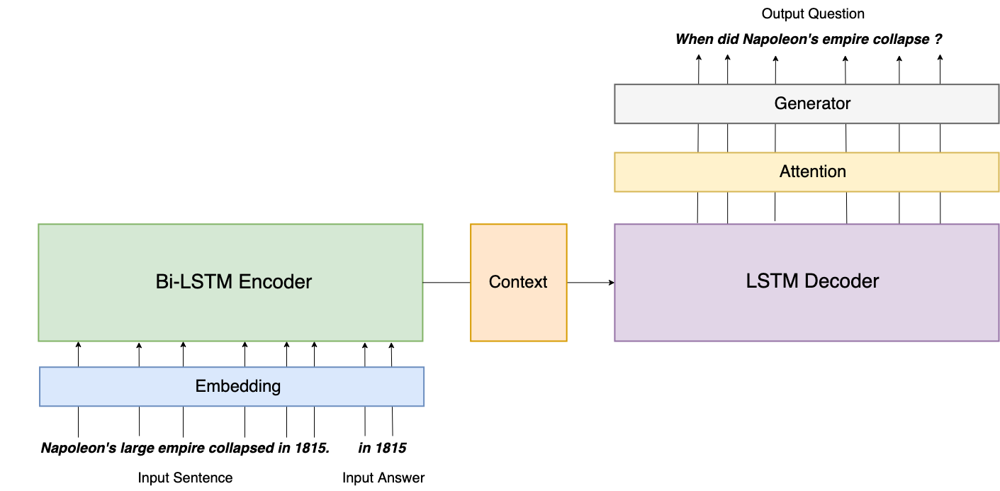
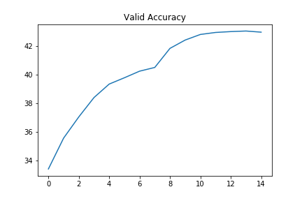
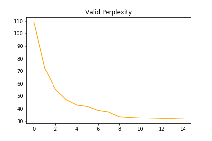
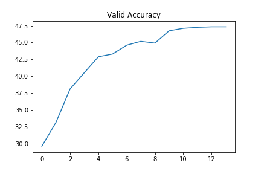
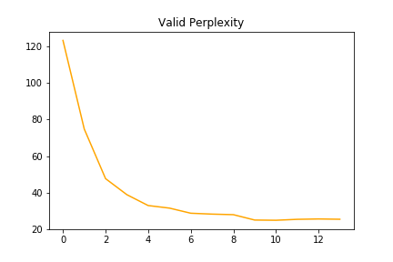
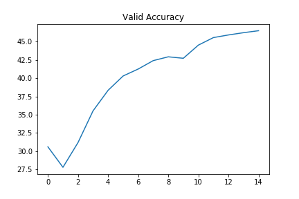
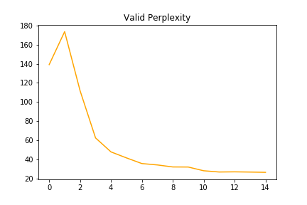

# Neural Question Generation: Learning to Ask

### Adapted from

[GauthierDmn's Implementation](https://github.com/GauthierDmn/question_generation) for usage with PyTorch Lightning/TPU

This projects aims at exploring automatic question generation from sentences in reading comprehension passages using deep neural networks.

We can interpret this task as the reverse objective of Question Answering, where given a sentence and a question, we build an algorithm to find the answer. Here the goal is to generate a question given a sentence in input, and potentially an answer.

Various paradigms can be considered:
* given a sentence, generate a question on the sentence. This paradigm is very close to what is being done in Machine Translation where given an input sentence in language A, we intend to translate it into the corresponding sentence in language B. The main difference results in the size of the output space, which is much larger for QG since a large number of questions can be created from a sentence.
* given a sentence and an answer, a span in the sentence, generate a question on the sentence that can be answered by the answer we gave. The difference with the previous paradigm is that here the output space of potential generated question is much narrower since it is restricted by the answer.
* given a paragraph, a sentence in the paragraph, an answer in the sentence, generate a question on the sentence that can be answered by the answer we gave. Here the paragraph could potentially help to generate a valid question, providing more context than the standalone sentence.

For now, I implemented a baseline as described in Xinya Du, Junru Shao and Claire Cardie 's paper Learning to Ask: Neural Question Generation for Reading Comprehension, following the first paradigm.

For their work, they used OpenNMT, a library built on top of Torch (resp. OpenNMT-py on top of PyTorch) specifically designed for Neural Machine Translation modeling.

For learning purpose and fun, I decided to implement their work in PyTorch directly. Now if you are looking for performance, I highly advise you to have a look at OpenNMT instead, since their implementation is more efficient than mine.

# Model Architecture

# Code Organization

    ├── config.py          <- Configuration file with data directories and hyperparamters to train the model
    ├── preprocessing.py   <- Preprocess the input text files, building datasets and vocabularies for model training
    ├── layers.py          <- Define the various layers to be used by the main model
    ├── make_dataset.py    <- Download the SquAD and NewsQA datasets we use for this experiment
    ├── model.py           <- Define the Seq2Seq model architecture, with an encoder and a decoder
    ├── requirements.txt   <- Required Python libraries to build the project
    ├── train.py           <- Train the model
    ├── eval.py            <- Use the model to generate questions on unseen data
    ├── utils.py           <- Group a bunch of useful functions to process the data

# Results

* Using only a sentence as input

Accuracy and perplexity after 15 epochs:

| ACC  | PLP |
| -----|:---:|
| 43%  | 32.2|

* Using a sentence and the answer to the question to be created

Accuracy and perplexity after 15 epochs:

| ACC  | PLP |
| -----|:---:|
| 47.3%| 25.2|

* Using the full paragraph and the answer to the question to be created

Accuracy and perplexity after 15 epochs:

| ACC  | PLP |
| -----|:---:|
| 46.5%| 26.6|

# Set-Up

Before running the following commands to train your model, you need to download the NewsQA dataset manually [here](https://github.com/Maluuba/newsqa). Follow the steps they describe, but you basically need to download the data as a ZIP file and use the helper functions provided to wrap it into a JSON file.

Once it is done:

* Clone this repository
* Create a directory for your experiments, logs and model weights: `mkdir output`
* Download GloVE word vectors: https://nlp.stanford.edu/projects/glove/
* Modify the `config.py` file to set up the paths where your GloVE, SquAD and NewsQA datasets, and where your models will be saved
* Create a Python virtual environment, source to it: `mkvirualenv qa-env ; workon qa-env` if you use virtualenvwrapper
* Install the dependencies: `pip install -r requirements.txt ; python -m spacy download en`
* Run `python make_dataset.py` to download SquAD dataset, and join SQuAD and NewsQA datasets into a single file
* Run `python preprocessing.py` to preprocess the data
* Run `python train.py` to train the model with hyper-parameters found in `config.py`
* Run `python eval.py` on a test file to generate your own questions!

# Next Steps
 
- [ ] Use a pointer-generator to copy words from the source sentence
- [ ] Improve the training process including Reinforcement Learning rewards such as in [this paper](https://arxiv.org/pdf/1705.02012.pdf)
- [ ] Investigate Transfer Learning as well as Multi Task Learning

# Resources

* SQuAD dataset: https://arxiv.org/abs/1606.05250
* NewsQA dataset: https://datasets.maluuba.com/NewsQA
* GloVE: https://nlp.stanford.edu/projects/glove/
* Learning to Ask: Neural Question Generation for Reading Comprehension by Xinya Du, Junru Shao, Claire Cardie: http://arxiv.org/abs/1705.00106
